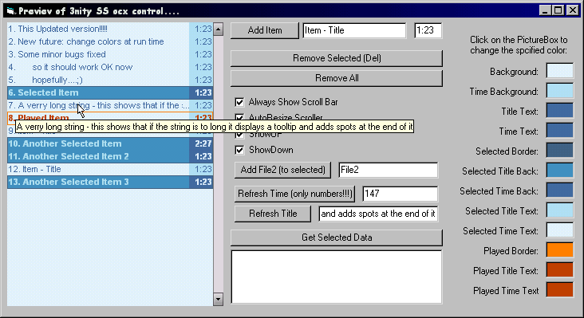



## A Winamp 3 Style playlist \(Update v 1\.1\!\!\) Must try

### Description

HEre is an update to my code... Now it futures color changing at run time... Fixed some bugs... And has all the futures from previous version: Skinable Scroll bar, multiselect, add an entry, remove one, remove all, remove all selected (multi selected), Dubble selected (played), Display time & title... Everything u need for a media player.. And an extra second file name property (I use it for subtitles in my program...)... And reorder in Winamp 3 style... -Very precise and not buggy at all... There might be some more bugs (please report), but as far as i know it works perfectly... Try it and vote it (i need to see if it was worth of publishing it...)
 
### More Info
 

             |
---                |---
**Submitted On**   |2003-09-18 11:38:50
**By**             |[3nity](https://github.com/Planet-Source-Code/PSCIndex/blob/master/ByAuthor/3nity.md)
**Level**          |Advanced
**User Rating**    |5.0 (10 globes from 2 users)
**Compatibility**  |VB 6\.0
**Category**       |[Custom Controls/ Forms/  Menus](https://github.com/Planet-Source-Code/PSCIndex/blob/master/ByCategory/custom-controls-forms-menus__1-4.md)
**World**          |[Visual Basic](https://github.com/Planet-Source-Code/PSCIndex/blob/master/ByWorld/visual-basic.md)
**Archive File**   |[A\_Winamp\_31653761042003\.zip](https://github.com/Planet-Source-Code/3nity-a-winamp-3-style-playlist-update-v-1-1-must-try__1-48997/archive/master.zip)

